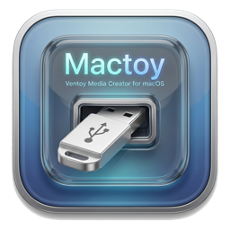

<p align="center">
  
</p>

<h1 align="center">Mactoy</h1>

<p align="center">
  Native macOS app for installing Ventoy on a USB drive — no Linux VM, no macFUSE, no booting a live CD just to flash a stick.
</p>

<p align="center">
  <a href="LICENSE"></a>
  <a href="https://developer.apple.com/macos/"></a>
  <a href="https://swift.org"></a>
  <a href="https://ko-fi.com/cash508287"></a>
</p>

<p align="center">
  <a href="https://ko-fi.com/cash508287"></a>
</p>

> **Heads up on the icon.** The header art above is a placeholder that still has some rough edges — mixed anti-aliasing on the bezel, slightly uneven inner text rendering at small sizes. A proper redesign is in progress and will land in a future release.

## Why Mactoy exists

[Ventoy](https://www.ventoy.net) is the best way to carry a toolkit of bootable OSes on a single USB — install it once, then just drop ISOs on the drive and pick one at boot. The problem: **Ventoy has no macOS installer.** The official options are all workarounds:

- Boot the Ventoy LiveCD from a *second* USB stick, then use that to install Ventoy onto your real stick.
- Spin up a Linux VM (UTM, Parallels) with USB passthrough, then run `sh Ventoy2Disk.sh` inside it.
- Dual-boot into a Linux install you may not have.

All of these require a second machine, a second USB, or hours of setup before you can do a five-minute task. The one macOS-native alternative that actually works is a [Python proof-of-concept gist](https://gist.github.com/VladimirMakaev/93503ab7c63c7bf4b0cada5db726614a) — which requires Homebrew (`xz`), running as `sudo`, typing raw device paths, and no progress feedback. Great that it exists. Not great to hand to a non-terminal user.

Separately, **balenaEtcher** can flash a single `.iso` to a drive, but that's not the same thing — it produces a one-boot stick, not a Ventoy multi-boot library. So mac users have been stuck picking between "flash one ISO easily" and "install Ventoy painfully."

And the [Mac App Store sandbox forbids privilege escalation and raw block-device access](#why-not-the-mac-app-store), which is exactly what a USB-flashing tool needs — so there's no polished first-party App Store option, and never will be. Every serious disk utility on macOS (Disk Utility aside) ships as a Developer ID–notarized download.

**Mactoy fills that gap.** Ventoy install from macOS, native SwiftUI, drag-and-drop, one auth prompt, Apple-notarized. It ports the Python gist's logic to Swift line-by-line (with unit tests cross-validating the GPT layout), drops it behind a Liquid Glass UI, and throws in a raw-image "just flash this one ISO" mode so you don't need Etcher for that either.

## What it does

1. **Install Ventoy** on a USB drive — download from GitHub releases, partition, write the bootloader, format the data partition as exFAT. Done from macOS, not a Linux VM.
2. **Flash a raw image** (`.iso`, `.img`, `.img.xz`, `.img.gz`) — a one-shot `dd` replacement with a progress bar and drag-and-drop. Use this when you want a single-boot stick; use Install Ventoy when you want a multi-boot library.
3. **Manage an existing Ventoy disk** — list, add, and remove ISOs on a mounted `Ventoy` volume without dropping to Finder.

Both write modes share one Liquid Glass UI and one privileged helper binary.

---

## Status — v0.1.1 alpha

- [x] GPT + boot-image math ported from the Python proof-of-concept (cross-validated: Swift and Python produce bit-identical layouts for the same disk).
- [x] Ventoy install flow end-to-end (download → extract → partition → write → format).
- [x] Raw image flashing with `.xz` and `.gz` decompression.
- [x] Liquid Glass SwiftUI interface (macOS 26 Tahoe).
- [x] Unit tests for partition layout, GPT header/entry/CRC, MBR, and plan validation.
- [x] **Developer ID signed + Apple notarized.** DMG and app are signed with "Developer ID Application: Clayton Conway (MUQ3H79Y4N)" under the hardened runtime, notarized by Apple, and the notary ticket is stapled to the DMG. `spctl --assess` reports `accepted, source=Notarized Developer ID`.
- [ ] **Not yet verified on real hardware by the author.** The code is a faithful port of a Python script that successfully flashed a Ventoy drive on the same machine this was built on; first-party hardware confirmation comes in v0.1.1.
- [ ] SMAppService privileged helper (currently uses `osascript`-based admin prompt; migration to SMAppService is planned for v0.2).

## Installing

### Download

Grab `Mactoy-<version>.dmg` from the [Releases page](https://github.com/cashcon57/mactoy/releases/latest).

### Open it

1. Open `Mactoy-0.1.1.dmg`.
2. Drag `Mactoy.app` into `/Applications`.
3. Launch from Launchpad or `/Applications`. Opens normally — no right-click dance needed. The DMG is Apple-notarized, so Gatekeeper sees it as a known-good Developer ID build.

## Using Mactoy

### Install Ventoy on a USB drive

1. Plug in a USB drive. It appears in the sidebar.
2. Click the disk card to select it.
3. Stay on the **Install Ventoy** tab. The **Version** dropdown defaults to "Latest"; pick a specific release, or choose **Custom…** to type a tag yourself. Click **Install Ventoy**.
4. Authenticate when macOS asks for admin rights (this is needed to write raw bytes to the disk; see [Security](#security-model)).
5. Wait for the progress bar. When done, the new `Ventoy` volume mounts on your Desktop.
6. Drag any `.iso`, `.img`, or `.wim` onto the `Ventoy` volume. Boot the USB on any machine and Ventoy will list the images.

### Flash a raw image

1. Switch to the **Flash Image** tab.
2. Drag an ISO / IMG onto the drop zone (or click to browse). `.xz` and `.gz` compressed images are auto-decompressed.
3. Select target disk in sidebar.
4. Click **Flash Image**, authenticate, wait.

### Manage ISOs on an existing Ventoy drive

1. Plug in a Ventoy-formatted USB that's already mounted.
2. Switch to the **Manage Disk** tab.
3. Add new ISOs or remove old ones without needing Finder.

## Architecture

```text
┌─────────────────────────────┐   stdin: plan JSON   ┌─────────────────────────────┐
│  Mactoy.app  (user, GUI)    │ ───────────────────► │  mactoyd  (helper, root)    │
│  SwiftUI + Liquid Glass     │ ◄─────────────────── │  GPT writer, boot images,   │
│  DiskArbitration, URLSession│   stdout: NDJSON     │  newfs_exfat, fsync         │
└─────────────────────────────┘      progress        └─────────────────────────────┘
         │                                                        ▲
         │  osascript admin prompt                                │
         └────────────────────────────────────────────────────────┘
```

- **Mactoy** — SwiftUI app. Enumerates disks, downloads Ventoy from GitHub releases, drives the UI, launches `mactoyd` under admin privileges via `osascript` (one auth prompt per install).
- **mactoyd** — tiny Swift CLI bundled inside `Mactoy.app/Contents/Resources/`. Reads a JSON `InstallPlan` from stdin, writes to `/dev/rdiskN`, reports NDJSON progress to stdout. Refuses to run unless EUID 0.
- **MactoyKit** — Swift Package with all the install logic (GPT construction, Ventoy download + extract, driver protocol, raw image flasher). Linked by both the app and the helper.

### Why not the Mac App Store?

The MAS sandbox forbids privilege escalation and raw block-device access, which is exactly what any USB-flashing tool needs. Privileged helper tools (SMJobBless, SMAppService, AuthorizationExecuteWithPrivileges) all require entitlements MAS review rejects, and even Full Disk Access isn't granted to sandboxed helpers. Every disk utility on macOS (Disk Utility aside) distributes outside the App Store for this reason. Mactoy ships as a Developer ID–signed, Apple-notarized DMG; a Homebrew cask is on the roadmap.

### Why not Python-wrapped-in-Swift?

The [original proof-of-concept](https://gist.github.com/VladimirMakaev/93503ab7c63c7bf4b0cada5db726614a) that proved Ventoy can be installed from macOS without a VM is a Python script. Mactoy is a direct line-by-line Swift port. The port is cross-validated by unit tests: for the same disk size, the Swift layout math produces bit-identical output to the reference Python.

## Security model

- The helper binary is only invoked via `osascript` admin prompt — one authentication per install run.
- The helper refuses to run without root (`getuid() == 0`).
- The helper validates the incoming plan: no `disk0`/`disk1`, only external or removable volumes, size sanity-checked.
- The helper does not accept arbitrary shell commands. It reads a strongly-typed `InstallPlan` struct from stdin.
- No network access from the helper. All downloads happen in the user-privilege app.

## Building from source

### Requirements

- macOS 26 (Tahoe) or newer
- Xcode 26.2+ (Swift 6.2)
- `create-dmg` (for building the DMG): `brew install create-dmg`

### Build commands

```sh
git clone https://github.com/cashcon57/mactoy.git
cd mactoy

# Run tests (no root needed, no real disks touched)
swift test

# Build the app bundle (debug)
./scripts/build-app.sh

# Build the signed release bundle + DMG (requires a Developer ID cert in Keychain)
./scripts/build-app.sh release devid
./scripts/build-dmg.sh 0.1.1 devid

# Open
open build/Mactoy.app
```

### Repo layout

```text
Mactoy/
├── Package.swift
├── Sources/
│   ├── MactoyKit/           shared library (GPT, drivers, plan)
│   ├── mactoyd/             privileged helper CLI
│   └── Mactoy/              SwiftUI app
├── Tests/MactoyKitTests/    unit tests for GPT + plan
├── app-support/             Info.plist (outside SPM resources)
├── scripts/                 build-app.sh, build-dmg.sh
├── docs/specs/              design specs
└── build/                   (git-ignored) .app + .dmg output
```

## Roadmap

| Version | Feature                                                                    |
| ------- | -------------------------------------------------------------------------- |
| v0.1    | Ventoy install + raw flash + ISO library, signed + notarized, version picker (this release) |
| v0.2    | SMAppService privileged helper, Homebrew cask, first-party hardware CI     |
| v0.3    | SHA256 verification UI, NTFS option, per-disk exFAT label override         |
| v0.4    | Sparkle auto-update, Ventoy update-in-place (preserve data)                |
| v1.0    | Ventoy plugin (JSON) editor, persistence `.dat` creator, stability pass    |
| v1.1+   | Windows ISO driver, macOS installer USB driver                             |

## License

[MIT](LICENSE).

## Credits

- **Ventoy** — the bootloader that makes this useful. GPL-3. Not redistributed by Mactoy; downloaded from Ventoy's official GitHub releases at install time.
- **[VladimirMakaev/93503ab7c63c7bf4b0cada5db726614a](https://gist.github.com/VladimirMakaev/93503ab7c63c7bf4b0cada5db726614a)** — the Python proof-of-concept that proved this was possible. Mactoy ships a Swift line-by-line port of that logic.
- **[SWCompression](https://github.com/tsolomko/SWCompression)** — pure-Swift xz/gzip decompression.
- **[create-dmg](https://github.com/create-dmg/create-dmg)** — DMG packaging.
